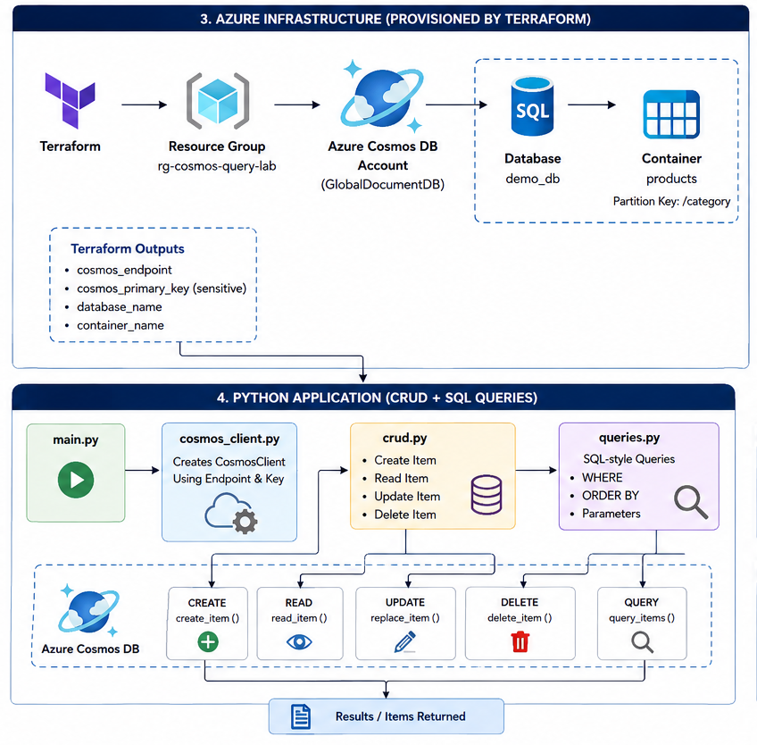

# Query Data with Azure Cosmos-DB
A hands-on Azure cloud project that demonstrates how to provision Azure Cosmos DB using Terraform and perform CRUD operations and SQL-style queries using Python.

# Architecture


## Project structure

```text
query-data-with-azure-cosmos-db/
├── app/
│   ├── cosmos_client.py
│   ├── crud.py
│   ├── queries.py
│   └── main.py
├── tests/
│   └── test_queries.py
├── terraform/
│   ├── main.tf
│   ├── variables.tf
│   ├── outputs.tf
│   └── provider.tf
├── .github/
│   └── workflows/
│       └── ci.yml
├── .gitignore
├── requirements.txt
└── README.md
```

## Prerequisites

Install:

- Azure CLI
- Terraform
- Python 3.10+
- An Azure subscription

Authenticate:

```bash
az login
az account set --subscription "<SUBSCRIPTION_ID>"
```

